# POC Scenario - Containerize a NodeJS Application

* [Introduction](#introduction)
* [Prerequisites](#prerequisites)
* Walkthrough
    * [Create Azure PostgreSQL](#create-azure-postgresql)
    * [Open Existing Application](#open-existing-application)
    * [Allow Client IP in Database Firewall](#allow-client-ip-in-database-firewall)
    * [Configure Container Registry](#configure-container-registry)
    * [Build the Container](#build-the-container)
    * [Build and Publish the Container](#build-and-publish-the-container)
    * [Run in an Ubuntu Image](#run-in-an-ubuntu-image)
    * [Create Azure Web App](#create-azure-web-app)
        * [Configure Environment Settings](#configure-environment-settings)

## Introduction
In this walkthrough we will look at building and deploying a NodeJS application into a container. Please ensure that Docker is switched over to Linux Containers, and is not set to Windows Containers. We will then publish that container in a couple of different ways. We will start with a deployment onto an Ubuntu server where we will deploy 3 instances of the app behind an nginx frontend. The second option will deploy the application to an Azure App Service.

## Prerequisites
To complete this POC, you will need:
* Access to a Microsoft Azure subscription and permissions to deploy resources
* A text editor such as [Visual Studio Code](https://code.visualstudio.com)
* [NodeJS](https://nodejs.org)
* [Docker for Windows](https://www.docker.com/docker-windows)
* If you are deploying the application on Ubuntu, you will need an ssh client e.g. [Putty](http://www.putty.org/)
* You will need the [sample application](https://ftashared.blob.core.windows.net/demos/Node-Todo.zip) we are deploying

## Create Azure PostgreSQL
1. Open the [Azure portal](https://portal.azure.cn)

2. Click to create a new resource. In the search dialog, search for *postgresql* and click the search button.

3. In the results window, select **Azure Database for PostgreSQL** and then click **Create**.

    

4. In the creation blade, provide the following values (you can substitute your own, but keep track of them):
    * Server Name: **mc-postgre-fta**
    * Resource Group: **mc-rg-fta-nodejs**
    * Server admin login name: **ftachina**
    * Password: *{Provide a value}*
    * Pricing Tier: **Basic**
    
    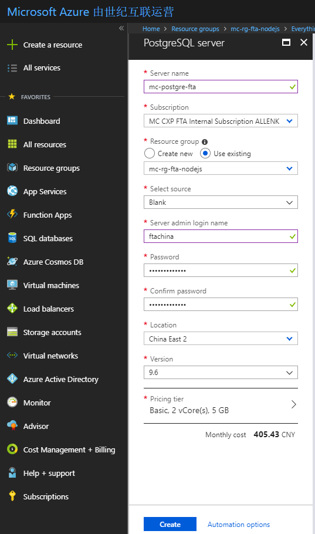

    Click **Create**.
    > Note: The provisioning can take up to 20 minutes.

## Open Existing Application
While the database is being provisioned, we can start working with the source code to prep it for going into a container.
1. Open Visual Studio Code and select the folder you extracted the application to.

2. Open a command prompt to the same directory. Then navigate to the **app** folder.

3. In the command prompt, type the command `npm install`.
    
    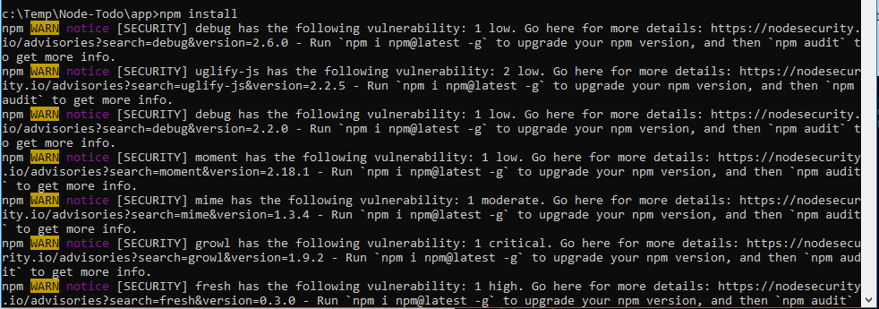

    > Note: Throughout this walkthrough, you can ignore errors and warnings about the use of Jade within the node application.

4. Once complete, type the command `npm run build`. This will compile the node application, written in Typescript, to javascript files in the `lib` folder.

5. If you run `npm start` the application should attempt to start, however an error will be thrown because there is no connection to a PostgreSQL instance. If you attempt to navigate to the site, you will see the basic application page, but with arrows indicating it is loading. You can navigate using this URL: `http://localhost:3000`.

    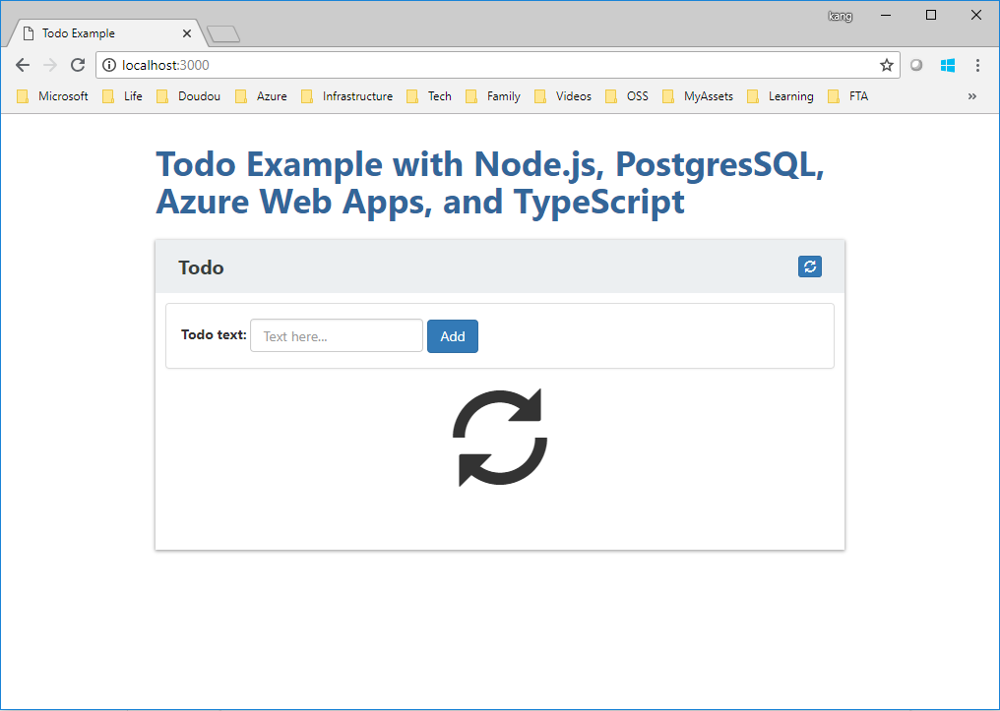


## Allow Client IP in Database Firewall
By now, the PostgreSQL database should be done provisioning. In order to allow our application to access it, we will need to make changes to the firewall rules.

1. Open the PostgreSQL instance from the Azure portal and navigate to **Connection Security**.
    
    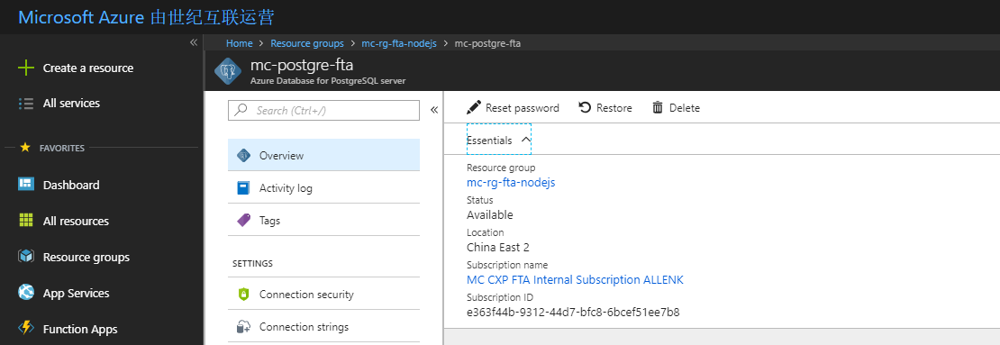

2. Under firewall rules, add a new rule with the following settings:
    * Rule Name: **All_IP_Addresses**
    * Start IP: **0.0.0.0**
    * End IP: **255.255.255.255**
    
    

    Click **Save**.
    > **Note**: this allows any IP anywhere in the world not be blocked by the PostgreSQL firewall. In a production environment, you would need to adjust these rules accordingly.

## Configure Container Registry
We will need a place to store the containers we are going to build in subsequent steps. For this demo we will use Azure Container Registry which will allow us a private repository to store our apps.

1. To create a registry, follow the steps on the [Azure documentation site](https://docs.microsoft.com/en-us/azure/container-registry/container-registry-get-started-portal#create-a-container-registry).

    > Note: For demo purposes, you can place the registry in the same resource group as the PostgreSQL database.

2. Make sure to keep track of the login name and password for the registry.

## Build and Publish the Container
1. In VSCode, in the **app** folder which is the root directory of the node application, create a new file and call it **Dockerfile**

2. In this file, add the following contents
    ```dockerfile
    FROM node:6-alpine

    ENV APPDIR=/usr/src/app

    RUN apk add --update git && \
        rm -rf /tmp/* /var/cache/apk/*
    
    COPY package.json /tmp/package.json
    RUN cd /tmp && npm install --production
    RUN mkdir -p "${APPDIR}" && cp -a /tmp/node_modules "${APPDIR}"

    COPY package.json "${APPDIR}"
    COPY lib /usr/src/app/lib
    COPY client/dist /usr/src/app/client/dist

    WORKDIR /usr/src/app
    COPY bin bin

    EXPOSE 3000
    CMD ["npm", "start"]
    ```

3. In your command prompt, run the following command from the **app** directory to build your container:
    ```cmd
    docker build -t {Your_Registry}/node-todo:latest .
    ```
    Where {Your_Registry} is the name of the registry you created in the Azure portal e.g. *mcacrfta.azurecr.cn*

    You should see output similar to the below:
    ```
    docker build -t mcacrfta.azurecr.cn/node-todo:latest .
    Sending build context to Docker daemon  63.91MB
    Step 1/13 : FROM node:6-alpine
    ---> cfabdfd5dcc7
    Step 2/13 : ENV APPDIR=/usr/src/app
    ---> Using cache
    ---> 32f1b0e83dec
    ...
    Step 12/13 : EXPOSE 3000
    ---> Running in 4feb4abbfab2
    Removing intermediate container 4feb4abbfab2
    ---> 691a8554998e
    Step 13/13 : CMD ["npm", "start"]
    ---> Running in 933cab5bb79e
    Removing intermediate container 933cab5bb79e
    ---> 066ef104745d
    Successfully built 066ef104745d
    Successfully tagged mcacrfta.azurecr.cn/node-todo:latest
    ```

4. In the **host** folder, we have a file called **nginx.conf** which is the configuration file for describing how our nginx host will work. We will need to create a Dockerfile for this as well. In that Dockerfile add the following contents
    ```dockerfile
    FROM nginx

    COPY nginx.conf /etc/nginx/nginx.conf
    ```
    > Note: This step is only needed if you are going to run the application on an Ubuntu VM.

5. In your command prompt, run the following command from **host** directory to build your container:
    ```cmd
    docker build -t {Your_Registry}/node-todo-host:latest .
    ```

6. Run the command `docker images` to see the images you just created.

7. Now, login to your registry with the command `docker login {Your_Registry}`
    > **Note**: The username and password are the values we saved earlier.

    Once completed, you should see `Login Succeeded`

8. Push the container to your registry with the following command:
    ```cmd
    docker push {Your_Registry}/node-todo:latest
    ```
    Once done, you should see something similar to:
    ```
    docker push mcacrfta.azurecr.cn/node-todo-host:latest
    ```

6. Run the command `docker images` to see the images you just created.

7. Now, login to your registry with the command `docker login {Your_Registry}`
    > **Note**: The username and password are the values we saved earlier.

    Once completed, you should see `Login Succeeded`

8. Push the container to your registry with the following command:
    ```cmd
    docker push {Your_Registry}/node-todo:latest
    ```
    Once done, you should see something similar to:
    ```
    docker push mcacrfta.azurecr.cn/node-todo:latest
    The push refers to repository [mcacrfta.azurecr.cn/node-todo]
    f9fcf76b4591: Pushed
    b8df0ba3fdba: Pushed
    7893b1bfb318: Pushed
    ...
    latest: digest: sha256:de3c85515c1ceeb7cfc37b47dacf97622eea2993b31848dbe64584d12dfdb126 size: 2624
    ```
    And if you created the nginx image, push that as well:
    ```cmd
    docker push {Your_Registry}/node-todo-host:latest
    ```


## Run in an Ubuntu Image
We will now start to look at hosting options for running our containers. In this first example, we are going to look at running our application on an Ubuntu VM with 3 instances of our app running behind an nginx front end.

1. Open the Azure portal

2. Create to create a new resource. In the search dialog, search for *ubuntu* and click the search button.

3. In the results window, select **Ubuntu Server 16.04 LTS** and then click **Create**.
    
    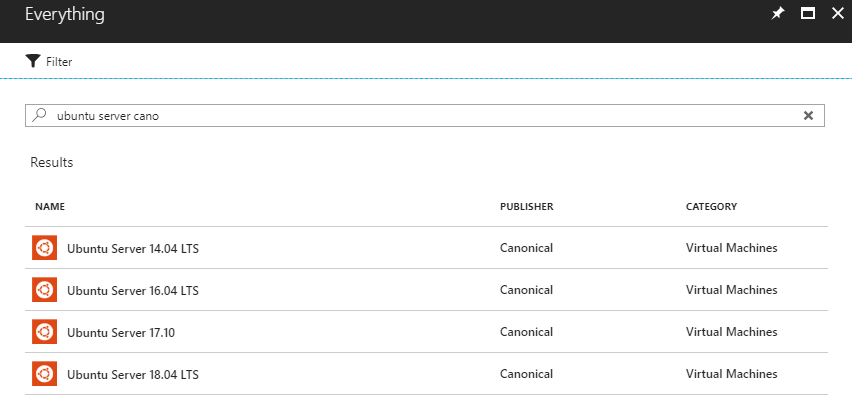

4. In the **Basics** blade, provide a name for the VM, authentication options, and resource group for the VM. Click **Ok**.
    
    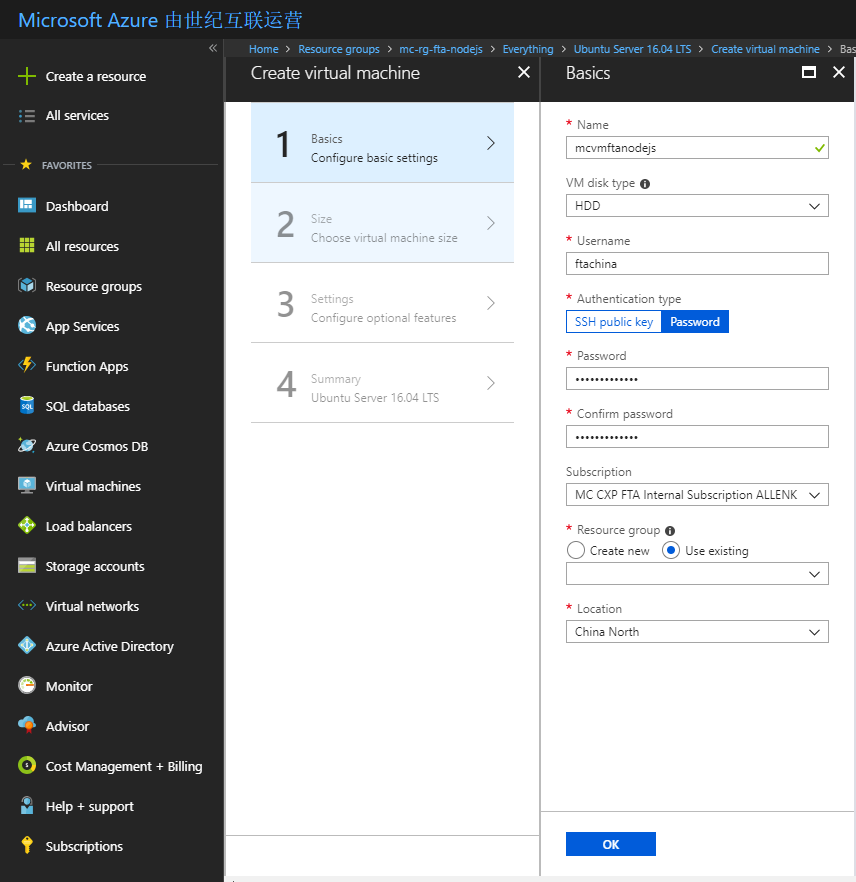

5. In the **Size** blade, select an appropriate VM size. Click **Select**.
    
    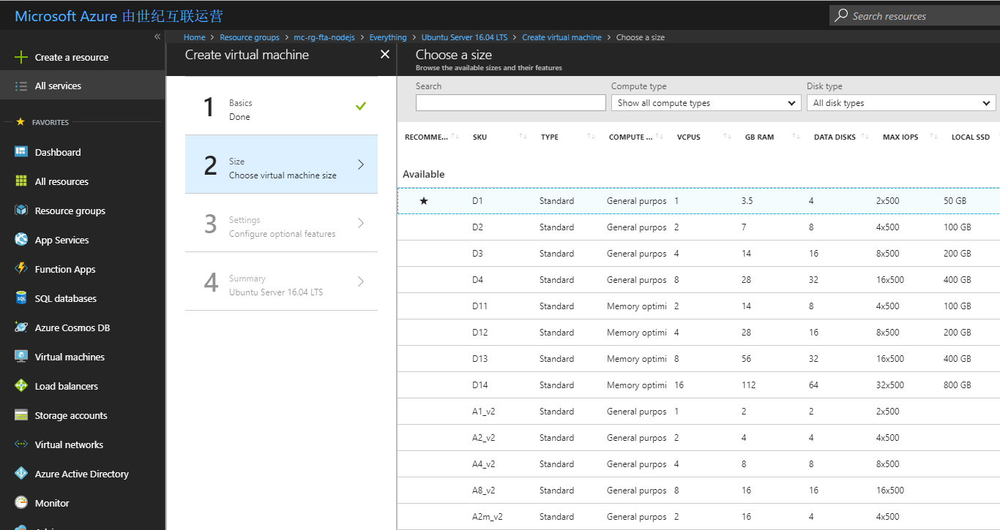

6. In the **Settings** blade, click **Network security group (firewall)** and then in **Create network security group**, select **Add an inbound rule**. Under **Service**, select the option for **HTTP** and click **Ok** to get back to the settings blade. Click **Ok** to move to the summary blade.
    
    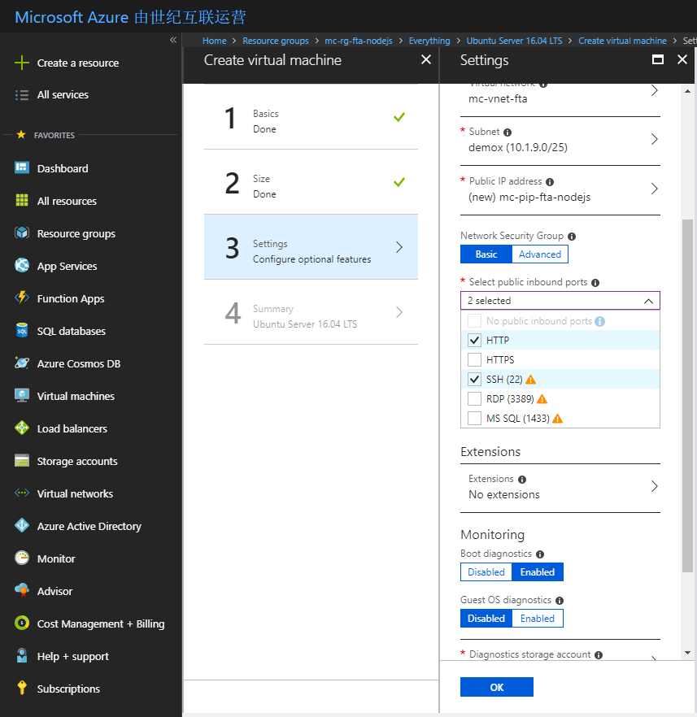

7. On the **Summary** blade, click **Create**.

8. Once the VM is provisioned, in the **Overview** pane, click the public IP address. In the **DNS name label** field, provide a public, globally unique name for your VM and then click **Save**.
    
    
    
    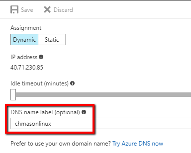

9. Once the DNS entry is updated, open your SSH client and connect to the VM you just created.

10. To install Docker, follow the [guide on Docker's website](https://docs.docker.com/engine/installation/linux/docker-ce/ubuntu/#install-docker-ce) to install Docker CE.

11. Once complete, we will need to install [Docker Compose](https://docs.docker.com/compose/install/#install-compose) as well.

12. On your Linux VM, we will need to create an appropriate docker-compose file. In your ssh console type `nano` to open the Nano editor.

13. In the console paste the following contents
    ```yaml
    version: '3'
    services:
      nginx:
        image: {Your_Registry}/node-todo-host:latest
        links:
          - node1:node1
          - node2:node2
          - node3:node3
        ports:
          - "80:80"

      node1:
        image: {Your_Registry}/node-todo:latest
        env_file:
          - prod.env

      node2:
        image: {Your_Registry}/node-todo:latest
        env_file:
          - prod.env

      node3:
        image: {Your_Registry}/node-todo:latest
        env_file:
          - prod.env
    ```

14. In the Nano editor, hit `Ctrl+O` to write the file. Give it the name **docker-compose.yml**. Hit `Enter` and then `Ctrl+X` to exit the nano editor.

15. You will notice in the docker-compose file, we reference a file called *prod.env*. This will hold environment variables we will need to use to connect to the PostgreSQL database we created earlier. In the ssh console type `nano` again to open a new editor.

16. In the editor, add the following contents (replace with your values if they are different):
    ```
    PGUSER=demo@postgrescontainerdemo.postgres.database.azure.com
    PGPASSWORD={Your_Password}
    PGDATABASE=postgres
    PGSERVER=postgrescontainerdemo.postgres.database.azure.com
    ```

17. In the editor, type `Ctrl+O` to write the file. Give it the name **prod.env** and hit `Enter` and `Ctrl+X` to save and exit.

16. In the SSH prompt type `sudo docker login {Your_Registry}`. Provide the name and password for your registry when prompted.

17. Run the command `sudo docker-compose up -d` to bring your application online.

18. Once the application is up, you can type the command `sudo docker-compose ps` to see the status of the different containers, in particular that the host container is exposed on port 80.
    
    

19. Outside of the Linux VM, open a browser and go to the hostname of your VM e.g. **http://{Your_VM}.eastus.cloudapp.azure.com** and you should see the To-Do application running.
    
    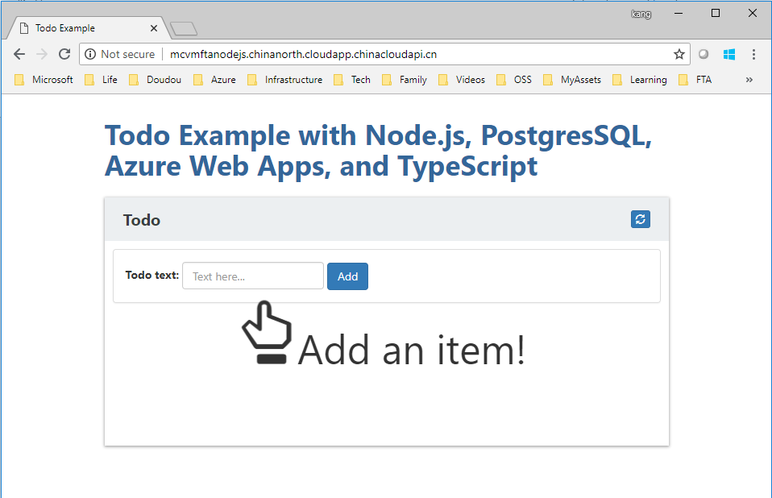

## Create Azure Web App
If you would rather avoid having to spin up a dedicated VM for hosting your application, another option is to use the Web App for Containers solution. This will provide a PaaS environment where we can deploy and scale our app without having to worry about any of the underlying infrastructure.

1. Open the Azure portal

2. Click to create a new resource. In the search dialog, search for *containers* and click the search button.

3. In the results window, select **Web App for Containers** and then click **Create**.
        
    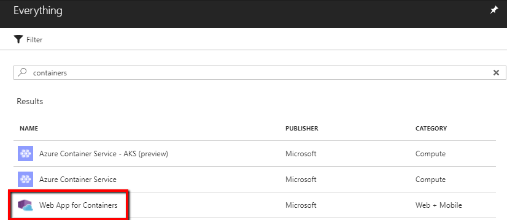

4. In the create blade, provide values for the app name and the existing resource group we have been using. Click on the **App Service plan / location** and adjust the name and location you want the app service deployed to.
        
    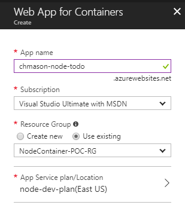

5. In the **Configure container** blade, select:
    * Image Source: **Azure Container Registry**
    * Registry: {Your_Registry}
    * Image: **node-todo**
    * Tag: **latest**
        
    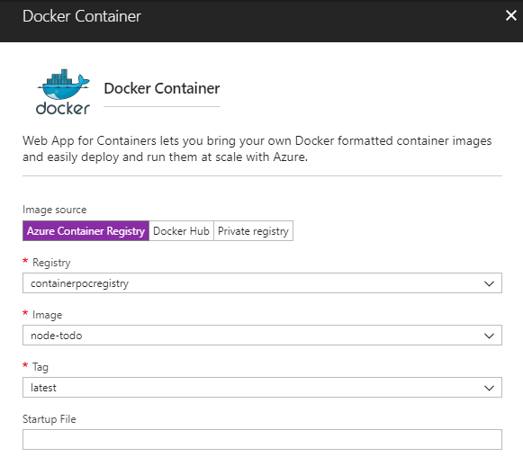

    Click **Ok**.

6. Click **Create** to provision the web app.

### Configure Environment Settings
Once the application is deployed, you could navigate to the url you created and the application should open, however the todo list will show a spinning logo indicating it is trying to connect to the database. Since we have not configured the settings to connect to our database, we will need to add those settings.

1. Open the web application properties in the Azure portal.

    

2. Navigate to the **Application settings** blade.

    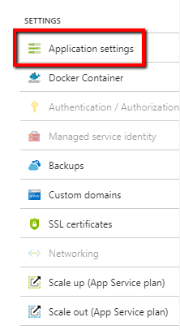

3. In the **App settings** section, add the following settings and their corresponding values (replace with your values if they are different):
    * PGUSER: **demo@postgrescontainerdemo.postgres.database.azure.com**
    * PGPASSWORD: *{Your_Password}*
    * PGDATABASE: **postgres**
    * PGSERVER: **postgrescontainerdemo.postgres.database.azure.com**

    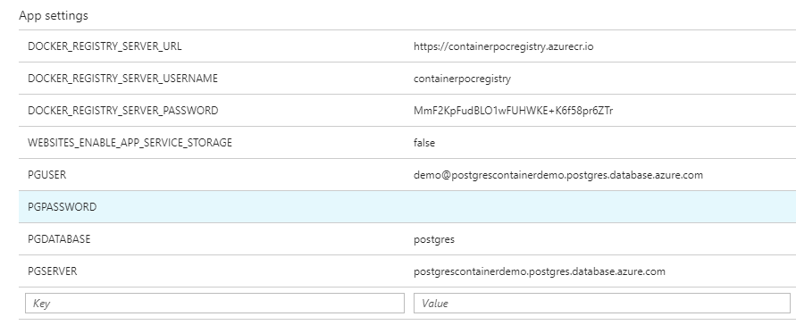

    Click **Save**.

4. Once the settings have saved, go back and refresh the application in your browser and you should see an empty list of todos and from there you can add some examples.

    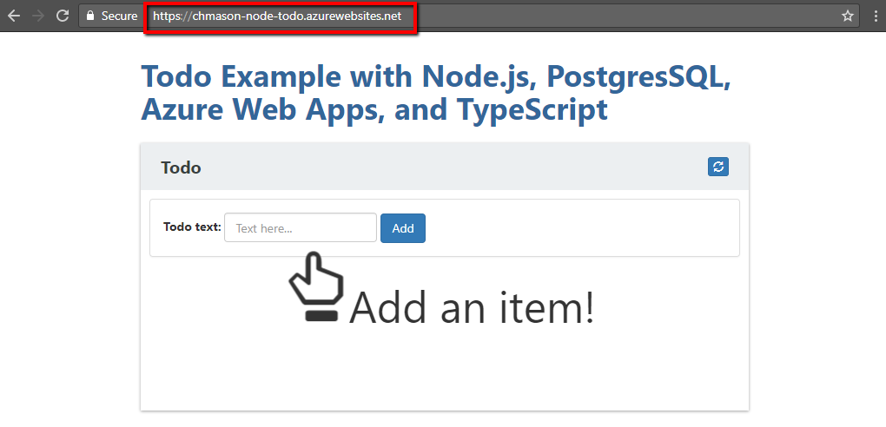

    > Note: If the settings do not immediately take effect, e.g. the loading arrows keep spinning, you may have to restart the app service. This can be done from the **Overview** blade of the app settings.
