# Walkthrough: Deploying Website on Azure IaaS VMs

## Table of Contents

* [Introduction](#introduction)
* [Learning objectives](#learning-objectives)
* [Prerequisites](#prerequisites)
* [Estimated time to complete this module](#estimated-time-to-complete-this-module)
* [Customize your Azure Portal](#customize-your-azure-portal)
* [Resource Group creation](#resource-group-creation)
* [Virtual Network creation](#virtual-network-creation)
* [Network Security Groups creation](#network-security-groups-creation)
* [Storage Account Creation](#storage-account-creation)
* [Virtual Machines creation](#virtual-machines-creation)
* [Install IIs on the Web VMs](#install-iis-on-the-web-vms)
* [Load Balancer creation](#load-balancer-creation)
* [Load Balancer configuration](#load-balancer-configuration)
* [Assign DNS name to Load Balancer](#assign-dns-name-to-load-balancer)
* [Testing](#testing)
* [Automation Scripts (ARM Template)](#automation-scripts-arm-template)
* [Visualize your Architecture with ArmViz](#visualize-your-architecture-with-armviz)


# Introduction

This walkthrough will show you how to bring together all the infrastructure components to build a sample application and making it scalable, highly available and secure.

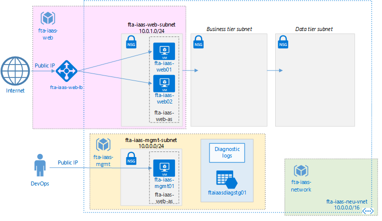


# Learning objectives

After completing the exercises in this walkthrough, you will be able to:
* Create a Resource Group
* Create a Virtual Network
* Create Network Security Groups(NSG)
* Create an availability set for VMs
* Create multiple virtual machines
* Create and setup a load balancer
* Deploy a website


# Prerequisites 

* Be familiar with the foundations of Azure Networking
* Be familiar with the foundations of Azure Storage
* Be familiar with the foundations of Azure Compute
* Review [Reference Resources](iaas-foundations-azurechina-reference-resources.md) if nedded.


# Estimated time to complete this module

Around 2/3 hours.


# Customize your Azure Portal

1. Launch [Azure Portal](https://portal.azure.com/).
2. On left most panel, click **All Services**.
3. Find and Pin, **Virtual networks**.
4. Find and Pin, **Availability sets**.
5. Find and Pin, **Load balancers**.
6. Find and Pin, **Network security groups**.

    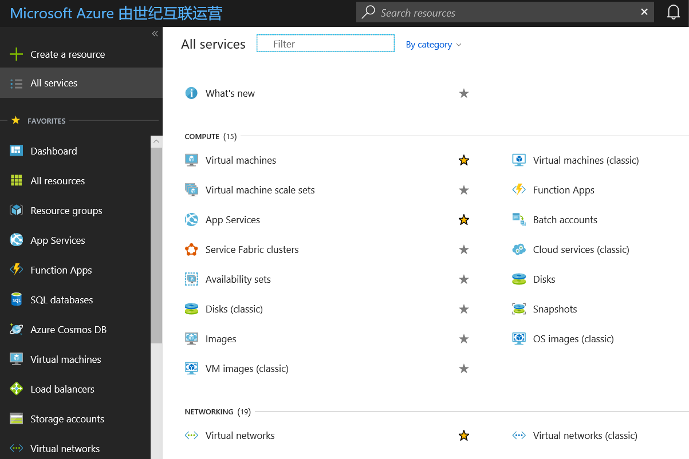


# Resource Group creation

> Note: For all **(prefix)** references, use a globally unique name to be used throughout this walkthrough. Suggested **fta-iaas**. Choose a **location** to use throughout the exercise.

> Guidelines to create and manage Resource Groups [here](https://docs.microsoft.com/en-us/azure/azure-resource-manager/resource-group-portal#manage-resource-groups)

1. Create the following Resource Groups 
    * **(prefix)-network**
    * **(prefix)-web**
    * **(prefix)-mgmt**

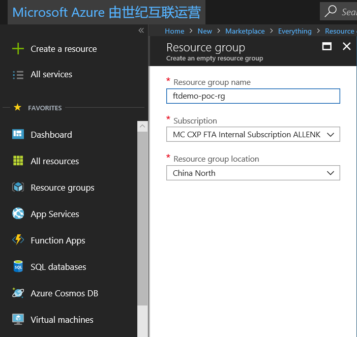


# Virtual Network creation

> Guidelines to create a Virtual Network [here](https://docs.microsoft.com/en-us/azure/virtual-network/quick-create-portal)

1. Create a Virtual Network with the following settings:
    * Name: **(prefix)-(region)-vnet** (e.g. fta-iaas-neu-vnet)
    * Address Space: **10.0.0.0/16**
    * Resource Group: **(prefix)-network** (select the one previously created)
    * Subnet name: **(prefix)-mgmt-subnet**
    * Subnet address space: **10.0.0.0/24**

> Guidelines to add Subnet to a Virtual Network [here](https://docs.microsoft.com/en-us/azure/virtual-network/virtual-network-manage-subnet#add-a-subnet)

2. Add the following subnet:
    * Subnet name: **(prefix)-web-subnet**
    * Subnet address space: **10.0.1.0/24**


# Network Security Groups creation

> Guidelines to create a Network Security Group [here](https://docs.microsoft.com/en-us/azure/virtual-network/virtual-networks-create-nsg-arm-pportal#create-the-nsg-frontend-nsg) 

> Guidelines to create rules in an NSG [here](https://docs.microsoft.com/en-us/azure/virtual-network/virtual-networks-create-nsg-arm-pportal#create-rules-in-an-existing-nsg)

> Guidelines to associate a NSG to a subnet [here](https://docs.microsoft.com/en-us/azure/virtual-network/virtual-networks-create-nsg-arm-pportal#associate-the-nsg-to-the-frontend-subnet)

## Network Security Group for the Management Subnet 

1. Create one NSG with the following settings:
    * Name: **(prefix)-mgmt-nsg**
    * Resource Group: **(prefix)-network** (select the one previously created)

2. Add one **Inbound security rule** with the following settings:
    * Source: **Any**
    * Source port ranges: **\***
    * Destination: **IP Addresses** 
    * Destination IP addresses: **10.0.0.0/24** (management subnet)
    * Destination port ranges: **3389**
    * Protocol: **TCP**
    * Action: **Allow**
    * Priority: **1000**
    * Name **AllowRDP**

3. Associate the management NSG (e.g. **fta-iaas-mgmt-nsg**) to the management subnet (e.g. **fta-iaas-mgmt-subnet**).


## Network Security Group for the Web Subnet

1. Create one NSG with the following settings:
    * Name: **(prefix)-web-nsg**
    * Resource Group: **(prefix)-network** (select the one previously created)

2. Add one **Inbound security rule** with the following settings:
    * Source: **Service Tag**
    * Source service tag: **Internet**
    * Source port ranges: **\***
    * Destination: **IP Addresses** 
    * Destination IP addresses: **10.0.1.0/24** (web subnet)
    * Destination port ranges: **80**
    * Protocol: **TCP**
    * Action: **Allow**
    * Priority: **1000**
    * Name **AllowHTTP**

3. Associate the web NSG (e.g. **fta-iaas-web-nsg**) to the web subnet (e.g. **fta-iaas-web-subnet**).


# Storage Account Creation

> Guidelines to create a Storage Account [here](https://docs.microsoft.com/en-us/azure/storage/common/storage-quickstart-create-account#create-a-general-purpose-storage-account)

1. Create one storage account for diagnostic llogs with the following settings:

    * Name: **(prefix)diagstg(uniqueid)**
    * Deployment model: **Resource manager**
    * Account kind: **StorageV2 (general-purpose v2)**
    * Replication: **Locally-redundant storage (LRS)**
    * Performance: **Standard**
    * Access tier: **Hot**
    * Secure transfer required: **Disabled**
    * Resource group: **Use existing** (select the Resource Group **(prefix)-mgmt** previously created)


# Virtual Machines Creation

> Guidelines to create a Virtual Machine [here](https://docs.microsoft.com/en-us/azure/virtual-machines/windows/quick-create-portal)

## Management VM

1. Create 1 jumpbox VM with the following settings:

    * Basics
        * Image from the marketplace: **Windows Server 2016 Datacenter**
        * Name: **(prefix)-mgmt01**
        * VM disk type: **HDD disk**
        * Resource Group: **Use existing** (select the Resource Group **(prefix)-mgmt** previously created)

    * Size
        * Size: **D1_V2** (or any equivalent)
    
    * Settings
        * Availability Set: create new > **(prefix)-mgmt-as**
        * Storage / use managed disks: **Yes**
        * Virtual Network: select the one previously create Virtual Network (e.g. **fta-iaas-neu-vnet**)
        * Subnet: select the web subnet previsouly created (e.g. **fta-iaas-web-subnet**)
        * Public IP address: create new > **(prefix)-mgmt01-ip**
        * Network Security Group: **None**
        * Diagnostics Storage account: select the storage account previously created (e.g. **ftaiaasdiagstg01**)


## Web VMs

1. Create 2 web VMs with the following settings:

    * Basics
        * Image from the marketplace: **Windows Server 2016 Datacenter**
        * Names: **(prefix)-web01** and **(prefix)-web02**
        * VM disk type: **HDD disk**
        * Resource Group: **Use existing** (select the Resource Group **(prefix)-web** previously created)

    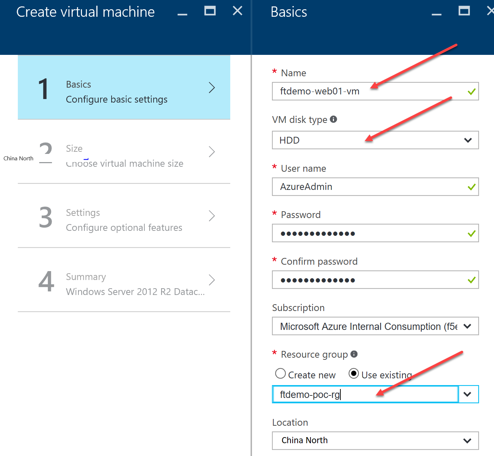

    * Size
        * Size: **D1_V2** (or any equivalent)
    
    * Settings
        * Availability Set: **(prefix)-web-as** (create it during the creation of the first VM)
        * Storage / use managed disks: **Yes**
        * Virtual Network: select the one previously create Virtual Network (e.g. **fta-iaas-neu-vnet**)
        * Subnet: select the web subnet previsouly created (e.g. **fta-iaas-web-subnet**)
        * Public IP address: **None**
        * Network Security Group: **None**
        * Diagnostics Storage account: select the storage account previously created (e.g. **ftaiaasdiagstg01**)

        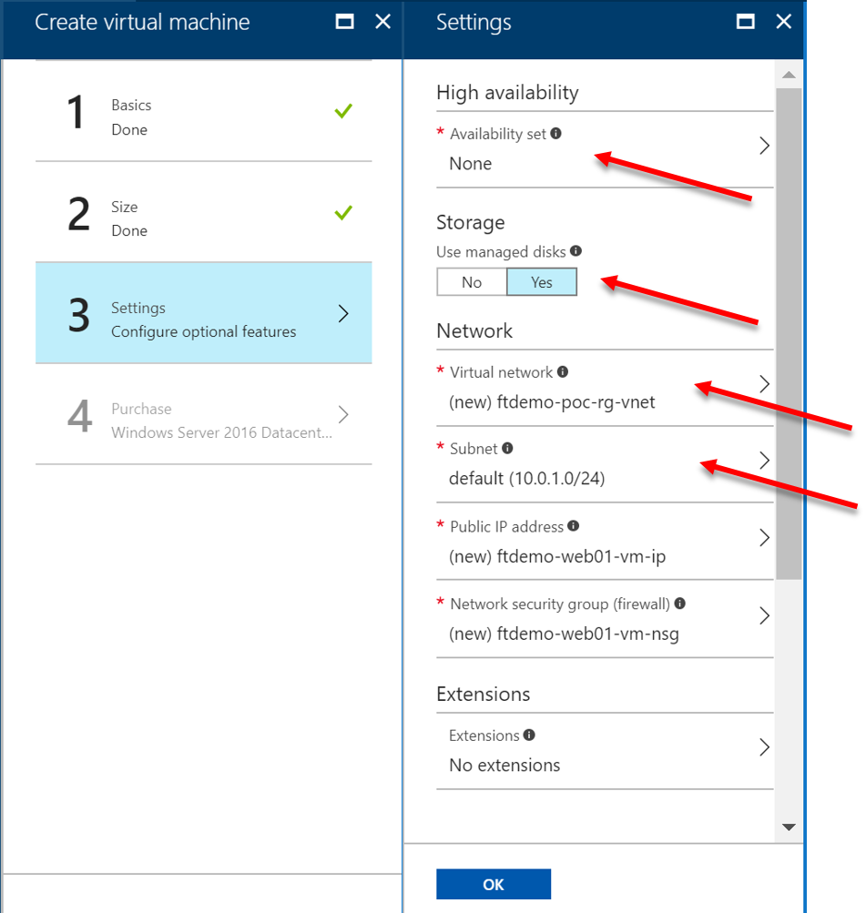


# Install IIS on the Web VMs

> Guidelines to connect to a Virtual Machine [here](https://docs.microsoft.com/en-us/azure/virtual-machines/windows/quick-create-portal#connect-to-virtual-machine)

For each of the web VMs do the following steps:

1. Connect via RDP to the jumpbox VM (e.g. fta-iaas-mgmt01). From this VM connect via RDP to both web VMs (using VM names or private IP addresses).

    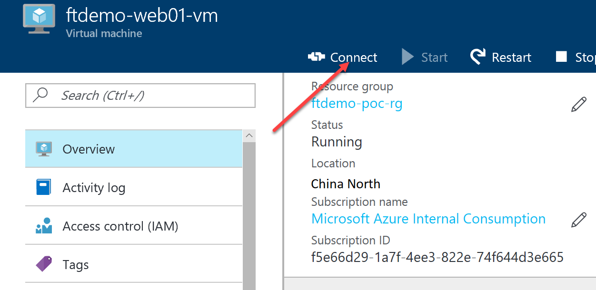

2. Install the Web Server role (IIS). Choose one of the options below (PowerShell or GUI):

    * **PowerShell**

        * Open **Windows PowerShell** as **Administrator**.

            

        * Run the following command:

            ```
            Install-WindowsFeature -name Web-Server -IncludeManagementTools
            ```

    * **GUI**

        * From the **Server Manager Dashboard**, select **Add Roles and Features**

            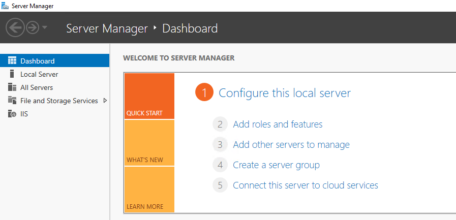

        * Click **Next** on **Before you Begin**
        * Click **Next** on **Installation Type**
        * Click **Next** on **Server Selection**
        * On **Server Roles**, select **Web Server IIS**
        * On **Add Roles and Features** popup, click **Add Features**
        * On **Server Roles**, click **Next**
        * On **Features**, click **Next**
        * On **Web Server Role(IIS)**, click **Next**
        * On **Role Services**, click **Next**
        * On  **Confirmation**, click **Install**

            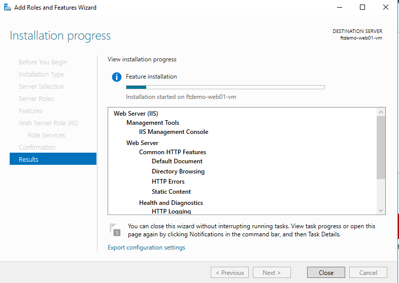

        * On  **Confirmation**, click **Close**

    > Note: Wait for the Web Server role installation to complete (PowerShell or GUI).

3. Launch the **Internet Information Services (IIS) Manager** from the **Server Manager** tools menu.
4. In the **Connections** panel, drill down to **Sites**.
5. **Right-Click** on **Default Web Site**, and select **Explore**.
6. From the **Windows Explorer**, **Right-Click** on the file **IISStart.html**, and open in **Notepad**.


7. Find the follow line right after the <**body**> tag and add the following.

   ```
   For VM1: <h1>This is Web Server 01</h1>
   For VM2: <h1>This is Web Server 02</h1>
   ``` 

  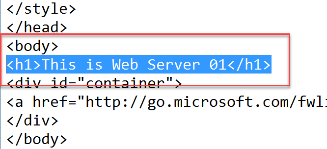


# Load Balancer creation

> Guidelines to create a Basic Load Balancer [here](https://docs.microsoft.com/en-us/azure/load-balancer/load-balancer-get-started-internet-portal)

1. Create a Basic Load Balancer with the following settings:
    * Name: **(prefix)-web-lb**
    * Type: select **Public**
    * SKU: select **Basic**
    * Public IP Address: **create new** with the following settings:
        * Name: **(prefix)-web-lb-pip**
        * Assignment: **Dynamic**

        

    * Resource Group: **Use existing** (select the Resource Group **(prefix)-web** previously created)

    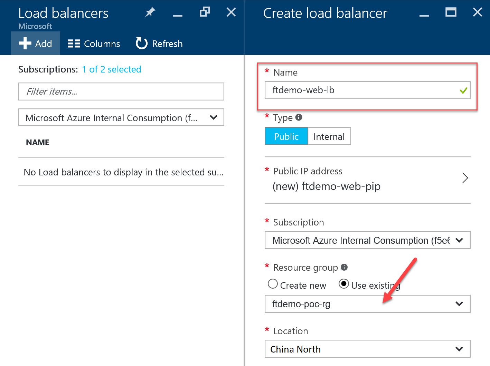


# Load Balancer configuration

> Guidelines to configure a Basic Load Balancer [here](https://docs.microsoft.com/en-us/azure/load-balancer/load-balancer-get-started-internet-portal#create-basic-load-balancer-resources)

1. After the **Load Balancer** is created, open it.

    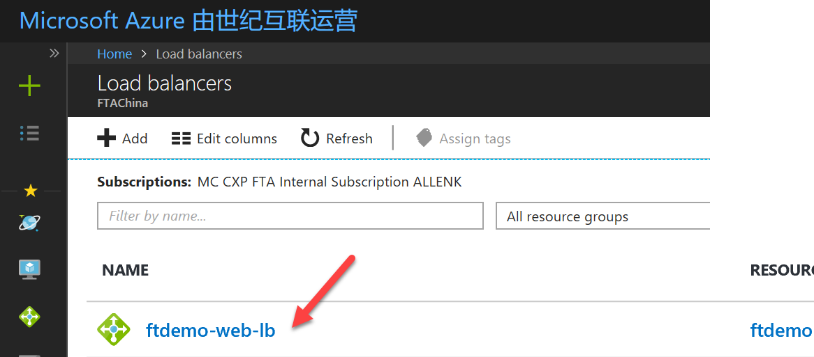

2. Create a backend address pool with the following settings:
    * Name: **(prefix)-backendpool**
    * Associated to: select **Availability set**
    * Availability set: select web availability set previously created (e.g. **fta-iaas-web-as**)
    * Target network IP configuration: select both web VMs previously created (e.g. **fta-iaas-web01** and **fta-iaas-web02**)

    

3. Create a health probe with the following settings:
    * Name: **(prefix)-healthprobe**
    * Protocol type: select **HTTP**
    * Port Number: **80**
    * Interval: **5**
    * Unhealthy threshold: **2**

    

4. Create a Load Balancer rule with the following settings:
    * Name: **(prefix)-httprule**
    * IP version: **IPv4**
    * Frontend IP address: select the one previously created (e.g.**LoadBalancerFrontEnd**)
    * Protocol type: select **TCP**
    * Port: **80**
    * Backend Port: **80**
    * Backend pool: select the one previously created (e.g. **fta-iaas-backendpool**)
    * Health probe: select the one previously created (e.g. **fta-iaas-healthprobe**)
    * Session Persistence: **None**
    * Idle timeout (min):**4**
    * Floating IP (direct server return): **Disabled**

    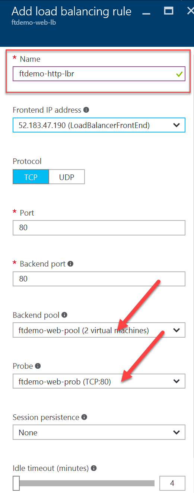
 

# Assign DNS name to Load Balancer

> Guidelines to configure a custom domain for services that use a public IP address [here](https://docs.microsoft.com/en-us/azure/dns/dns-custom-domain#public-ip-address)

1. Assing a custom domain name to the Load Balancer's IP Address (e.g. fta-iaas-contoso).

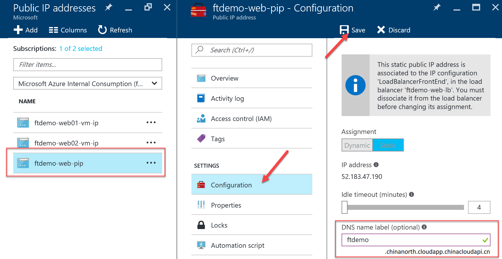


# Testing 

1. Browse to the load balancer public IP or **http://(prefix).(region).cloudapp.chinacloudapi.cn/**.
2. You will see the IIS server default page showing either Web Server 01 or 02.
3. If you see Web Server 01, then RDP into VM1, stop the Default Web Site in IIS. Refresh the web page, you will see Web Server 02. The Load balancer detects VM1 is down and redirects traffic to VM2.

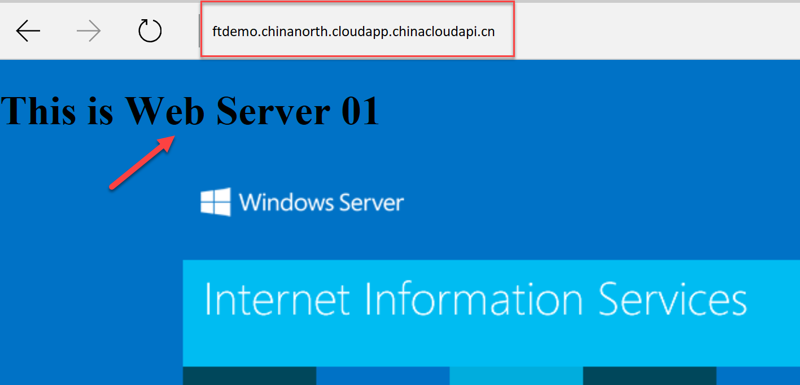


# Automation Scripts (ARM Template)

1. From the left panel on the Azure Portal, select **Resource Groups**.
2. Select **(prefix)-poc-rg**.
3. Under Settings, click **Download** | **Save As** | (select location).


4. After download, **Extract All** to (select location).


# Visualize your Architecture with ArmViz
 
1. Open browser and goto **http://armviz.io** to view the template.

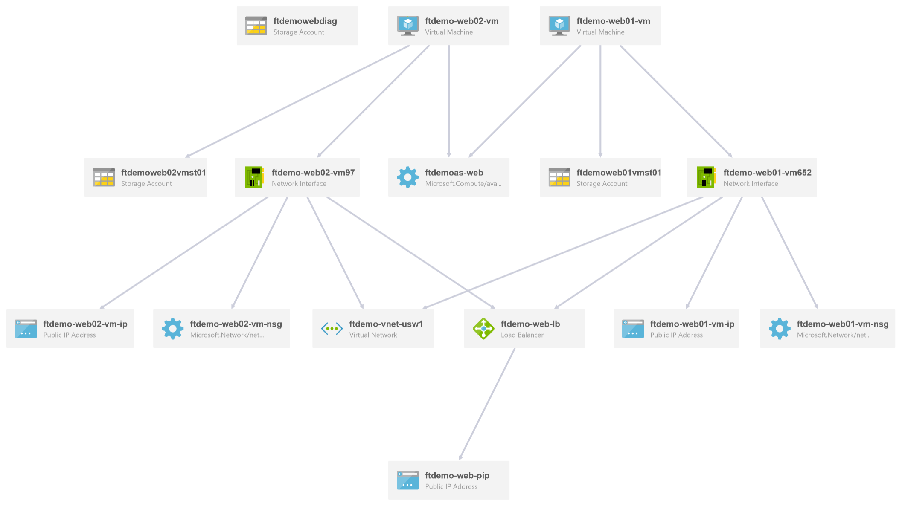

